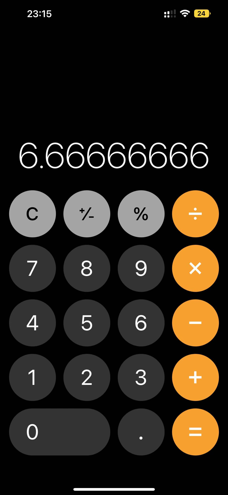

# 需求
写一个计算器类（calculator.Calculator），可以实现两个数的加、减、乘、除运算，并可以进行undo和redo操作

# 功能原型参考

# 设计考虑
普通计算器的功能，支持加、减、乘、除外， 支持undo和redo。
计算器的操作的最终计算，需要主动点击=才执行计算，故在程序上参考类型实现，在触发compute时计算所有数据。
因要实现undo/redo功能，需要记录操作的历史

1. undo功能说明
   撤销一次数据操作
2. redo功能说明
   在撤销的基础上重新执行计算
# 代码
  * Calculator.java 实现
  * Client.java 执行案例

# 特殊情况

* 边界情况
   1. 数据溢出（可能是超大整数或小数）
      解：使用BigDecimal类型
   2. 除数为0
      解：除数为0终止程序,异常退出-1

* 操作优先级
   1. 乘、除优先于加减
      解：借助栈实现优先级计算   
   
* 计算数据存储上限
   机器内存上限

# 测试用例覆盖
1. 案例1-常规加、减、乘、除计算
   100 + 50 * 20 / 2 - 10 = 590

2. 案例2-执行两次undo后redo
   原：100 + 50 * 20 / 2 - 10 = 590 =》 100 + 50 * 20 = 1100

3. 案例3-除数为0
   100 / 0 = 程序退出

4. 案例4-超大数计算
   todo
